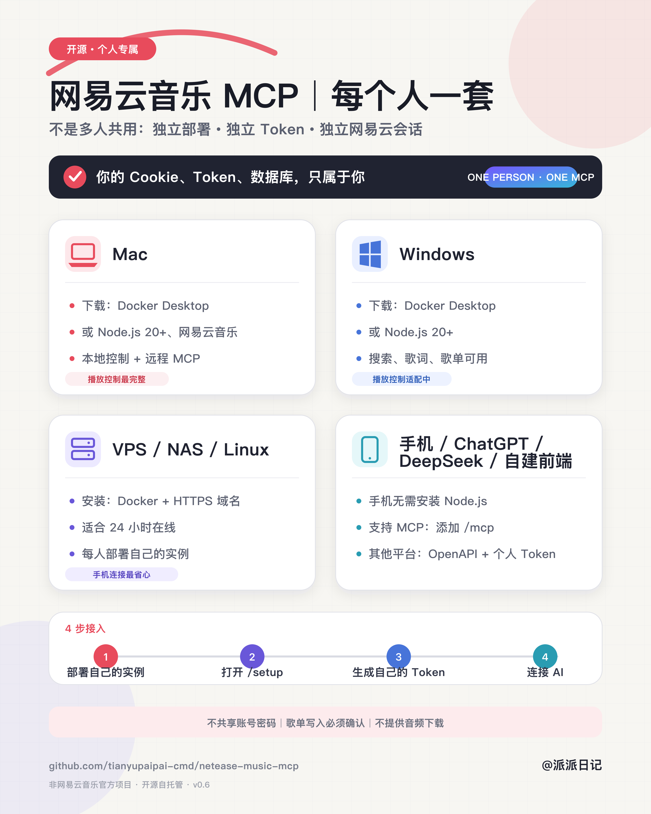

# 网易云音乐 MCP

一个隐私优先、可自托管的网易云音乐 Model Context Protocol 服务。它把
搜索、歌曲详情、歌词和个人歌单能力提供给任何支持 MCP 的客户端，同时把
本地播放器控制隔离在设备适配器中。

> 非网易云音乐官方项目，与网易公司无隶属或背书关系。

> **第一次接触 GitHub、Docker 或 MCP？**
>
> 请直接阅读 [网易云音乐 MCP 小白部署教程](docs/BEGINNER_GUIDE_ZH.md)，
> 从下载安装到域名、账号和各 AI 平台接入都按步骤写好了。

从 `v0.6.0` 起，项目同时提供：

- 本机单用户 stdio MCP；
- 兼容旧版秘密 URL 的私有 HTTP MCP；
- 标准 OAuth 2.1 个人远程 MCP（每个部署只有一个所有者）；
- 面向 ChatGPT、自建前端、DeepSeek 工具桥等客户端的 REST/OpenAPI 层。

## 可以在哪些设备使用

- **Mac**：全部通用能力；附带稳定的 macOS 网易云客户端控制。
- **Windows**：搜索、歌词、详情、歌单和 stdio/HTTP MCP 可用；本地播放
  控制适配器尚未标记为稳定。
- **Linux / VPS / NAS**：适合托管远程 MCP；提供搜索、歌词、详情和歌单
  能力，不负责操作桌面播放器。
- **Android / iPhone / 新设备**：使用支持远程 MCP 的客户端连接你自己
  托管的 HTTPS 地址，即可使用通用能力。云端服务不能绕过手机系统权限
  操控另一个 App；手机内切歌需要单独的本地伴侣程序。

完整矩阵见 [Platform support](docs/PLATFORM_SUPPORT.md)。

## 工具

### 所有平台

- `netease_status`：报告运行平台和可用设备适配器。
- `netease_search`：匿名搜索歌曲。
- `netease_song_detail`：读取歌曲详情。
- `netease_lyrics`：读取歌词、翻译和罗马音。
- `netease_playlist_auth_status`：检查歌单账号能力配置，不返回 Cookie。
- `netease_playlist_list`：列出当前账号创建的歌单。
- `netease_playlist_create`：创建公开或隐私歌单。
- `netease_playlist_add_songs`：添加歌曲到指定歌单。
- `netease_playlist_remove_songs`：从指定歌单移除歌曲。
- `netease_listen_together_capabilities`：报告当前设备的一起听能力。

### macOS 本地适配器

- `netease_launch`：启动官方客户端。
- `netease_open_entity`：打开歌曲、歌单、专辑或歌手页面。
- `netease_open_area`：打开私人 FM、下载管理或听歌识曲。
- `netease_control`：播放/暂停、上一首、下一首。
- `netease_next_track`：发送系统级下一首命令，不操控屏幕。
- `netease_listen_together_invite`：打开一起听邀请界面。

## 快速开始

需要 Node.js 20 或更高版本。

```bash
git clone https://github.com/tianyupaipai-cmd/netease-music-mcp.git
cd netease-music-mcp
npm ci
npm test
npm start
```

`npm start` 使用 stdio，适合本机 MCP 客户端。通用配置示例：

```json
{
  "mcpServers": {
    "netease-music": {
      "command": "node",
      "args": ["/absolute/path/to/netease-music-mcp/src/server.js"]
    }
  }
}
```

这不是某一个 AI 产品的专用格式；任何支持 stdio MCP 的桌面端或自建前端
都可以使用同一个服务。

## 个人成品 MCP（OAuth、独立部署）

个人模式使用你自己的地址 `https://your-domain.example/mcp`。支持远程
MCP OAuth 的客户端会自动完成客户端注册、PKCE 登录和授权。一次部署只能
初始化一个所有者；其他人应在自己的电脑、VPS 或容器中部署自己的实例，
不会共用 Cookie、数据库、Token 或调用额度。

所有者可以在自己的控制台生成、撤销个人 Token，供不支持 MCP OAuth 的
自建前端或工具调用平台使用。

初始化独立状态目录：

```bash
sudo install -d -m 700 -o netease-mcp -g netease-mcp /var/lib/netease-music-mcp
sudo -u netease-mcp npm run init:personal -- /var/lib/netease-music-mcp
```

配置：

```bash
NETEASE_PERSONAL_ORIGIN=https://music.example.com
NETEASE_PERSONAL_HOST=127.0.0.1
NETEASE_PERSONAL_PORT=3304
NETEASE_PERSONAL_STORE_FILE=/var/lib/netease-music-mcp/auth.json
NETEASE_PERSONAL_MASTER_KEY_FILE=/var/lib/netease-music-mcp/master.key
```

启动：

```bash
npm run start:personal
```

入口如下：

- MCP：`https://music.example.com/mcp`
- 用户控制台：`https://music.example.com/dashboard`
- OpenAPI：`https://music.example.com/openapi.json`
- REST：`https://music.example.com/api/v1`

完整的反向代理、OAuth、权限和迁移说明见
[Personal remote guide](docs/PERSONAL_REMOTE.md)。示例 systemd 与 Nginx 配置
位于 [`deploy/`](deploy/)。

不同设备分别需要安装什么、如何接入，见
[Device guide](docs/DEVICE_GUIDE.md)。



Docker 快速路径：

```bash
export NETEASE_PERSONAL_ORIGIN=https://music.your-domain.example
docker compose run --rm netease-mcp npm run init:personal -- /data
docker compose up -d
```

## 远程 HTTP 与手机连接

这一节是旧版秘密 URL 模式。新部署优先采用上面的个人 OAuth 模式。

先创建只允许当前用户读取的 64 位十六进制秘密：

```bash
mkdir -p ~/.netease-music-mcp
openssl rand -hex 32 > ~/.netease-music-mcp/http.secret
chmod 600 ~/.netease-music-mcp/http.secret
NETEASE_MCP_SECRET_FILE="$HOME/.netease-music-mcp/http.secret" npm run start:http
```

服务默认只监听 `127.0.0.1:3303`。请在它前面使用你自己的 HTTPS 反向代理
或零信任隧道，然后把最终地址
`https://your-domain.example/mcp/<64位秘密>` 加入支持 Streamable HTTP MCP
的客户端。

不要直接监听公网，不要提交或分享完整 MCP URL。手机可以连接这个远程地址，
但 Mac 睡眠或托管服务器停止后服务也会离线。

## 可选：启用个人歌单

账号写入默认关闭。项目不读取密码，只从指定文件加载 `MUSIC_U` 和可选
`__csrf`：

```text
MUSIC_U=你的值; __csrf=你的值
```

然后配置：

```bash
export NETEASE_MCP_ACCOUNT_WRITE_ENABLED=1
export NETEASE_MCP_COOKIE_FILE=/absolute/path/to/netease.session
```

macOS 用户可在官方客户端登录后运行：

```bash
npm run import:session:macos
```

脚本只保存白名单 Cookie，不打印秘密值。POSIX 系统要求会话文件权限为
`600`；Windows 请把文件 ACL 限制为当前用户。创建、添加和移除歌曲工具
仍要求本次调用显式传入 `confirm: true`。

## 安全和边界

- 不保存账号密码，Cookie、`.env`、会话文件和秘密文件均被 Git 忽略。
- 公共模式对密码使用 scrypt；访问令牌只保存 SHA-256 摘要，网易云会话
  使用 AES-256-GCM 按用户加密。
- OAuth 使用授权码 + PKCE、资源绑定和短期访问令牌；个人 Token 可撤销。
- 账号写工具默认关闭，且只能修改当前会话账号拥有的歌单。
- 不提供音频下载、解密、会员绕过或版权限制规避。
- 不调用私有聊天接口，也不自动发送一起听消息。
- macOS 播放控制可能需要“隐私与安全性 → 辅助功能/自动化”授权。
- `netease_next_track` 使用系统媒体命令，不读取画面或点击坐标，但只保证
  普通播放模式；一起听房间是否接受切歌由官方客户端决定。

披露安全问题前请阅读 [SECURITY.md](SECURITY.md)。

## 开发

```bash
npm ci
npm test
```

CI 在 macOS、Windows 和 Linux 的 Node.js 20/22 上运行。欢迎提交平台
适配器，但未在目标设备实测的能力必须标为实验性。

## License

[MIT](LICENSE)
